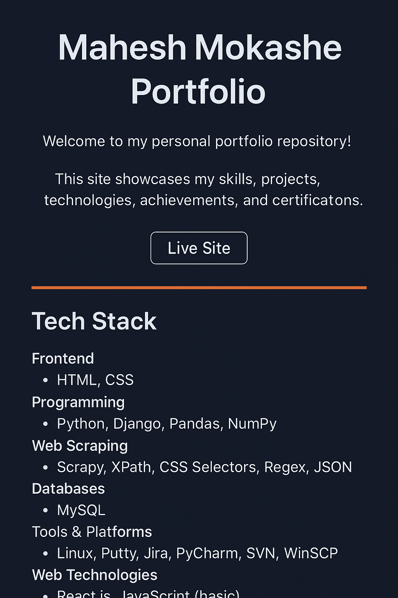

# Mahesh Mokashe · Software Engineer Portfolio

Welcome to my personal portfolio repository!  
This site showcases my work as a **Python Software Engineer**, focusing on **Backend Development (Django/FastAPI)**, **Full Stack interfaces (React.js)**, and **Scalable Data Mining**.

🌐 **Live Site**: [maheshmokashe.github.io/mahesh_portfolio](https://maheshmokashe.github.io/mahesh_portfolio/)  

---

## 📌 Preview



---

## 🚀 Tech Stack

### **Backend & APIs**
- **Languages**: Python (3.x)
- **Frameworks**: Django, FastAPI, Django REST Framework (DRF)
- **Database**: MySQL

### **Frontend & UI**
- **Library**: React.js
- **Core**: HTML5, CSS3, JavaScript
- **Styling**: Bootstrap, Responsive Design

### **Data Engineering & Scraping**
- **Tools**: Scrapy, Pandas, NumPy
- **Extraction**: XPath, CSS Selectors, Regex, JSON Parsing

### **DevOps & Tools**
- **Versioning**: Git, SVN, Bitbucket
- **Infrastructure**: Linux, Putty, WinSCP
- **Management**: Jira, PyCharm

---

## 📂 How to Run Locally

1. **Clone the repo:**
   ```bash
   git clone [https://github.com/Maheshmokashe/mahesh_portfolio.git](https://github.com/Maheshmokashe/mahesh_portfolio.git)
